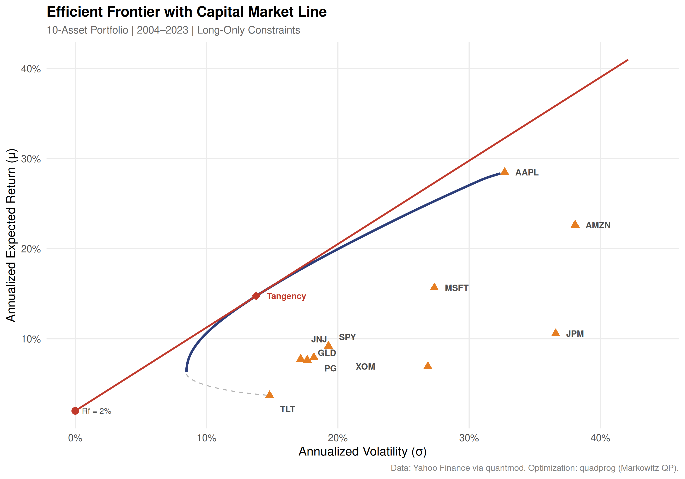
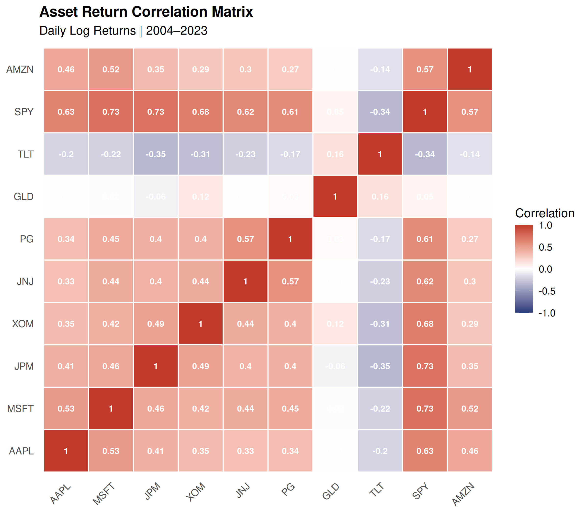
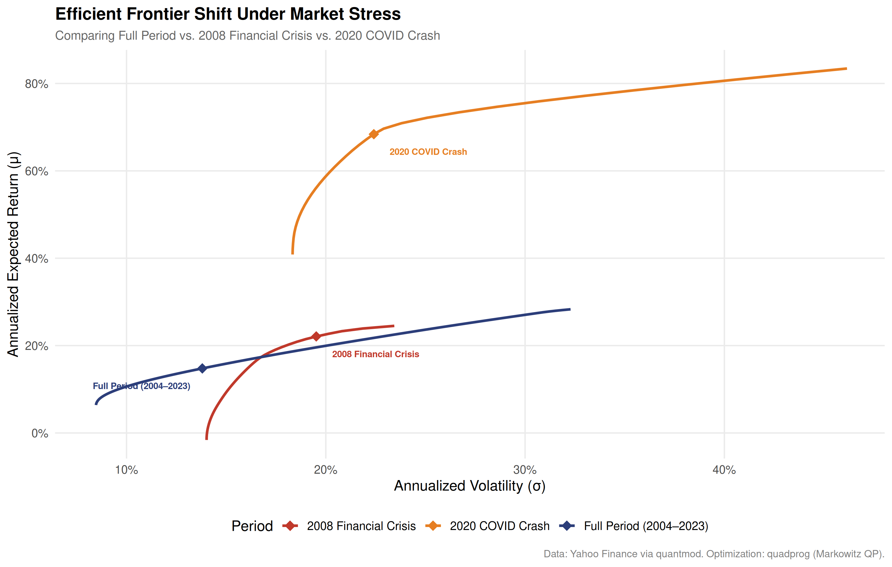

# Efficient Frontier Construction and the Limits of Mean-Variance Optimization

An end-to-end empirical implementation of Markowitz mean-variance optimization
in R, from raw market data ingestion through quadratic programming to
publication-quality figures and a full research paper.

**Read the paper:** [`outputs/efficient_frontier_paper.pdf`](outputs/efficient_frontier_paper.pdf)

---

## Overview

This project implements Modern Portfolio Theory (MPT) on a ten-asset portfolio
spanning 2004–2023, using real historical price data pulled directly from Yahoo
Finance. It constructs the efficient frontier via quadratic programming, derives
the Capital Market Line and tangency portfolio, and stress-tests the framework
against two distinct market crises: the 2008 Financial Crisis and the 2020
COVID-19 crash.

The central empirical finding is that the efficient frontier is not a stable
geometric object. It shifts dramatically under market stress, and the
optimizer fails in qualitatively different ways depending on the nature of
the crisis.

---

## Results

### Efficient Frontier with Capital Market Line


### Asset Return Correlation Matrix


### Frontier Shift Under Market Stress


---

## Portfolio Composition

| Ticker | Name | Sector | Asset Class |
|--------|------|--------|-------------|
| AAPL | Apple Inc. | Technology | Equity |
| MSFT | Microsoft Corp. | Technology | Equity |
| JPM | JPMorgan Chase | Financials | Equity |
| XOM | ExxonMobil Corp. | Energy | Equity |
| JNJ | Johnson & Johnson | Healthcare | Equity |
| PG | Procter & Gamble | Consumer Staples | Equity |
| GLD | SPDR Gold ETF | Commodities | ETF |
| TLT | iShares 20Y Treasury ETF | Fixed Income | ETF |
| SPY | SPDR S&P 500 ETF | Broad Market | ETF |
| AMZN | Amazon.com Inc. | Consumer Discretionary | Equity |

---

## Key Findings

| Period | MVP Volatility | MVP Return | Tangency Sharpe |
|--------|---------------|------------|-----------------|
| Full Period (2004–2023) | 8.47% | 6.39% | 0.926 |
| 2008 Financial Crisis | 14.02% | -1.61% | 1.029 |
| 2020 COVID-19 Crash | 18.33% | 40.86% | 2.964 |

During the 2008 crisis, the minimum achievable portfolio volatility nearly
doubled and the MVP return turned negative, a direct consequence of
correlation breakdown under systemic stress. During the 2020 crash, the
optimizer produced implausibly high Sharpe ratios from a 62-day sample,
illustrating the error-maximizing property of MVO under small-sample
estimation. Both results confirm that MVO is most unreliable precisely
when accurate risk estimation matters most.

---

## Project Structure

```
efficient-frontier/
├── R/
│   ├── 01_data_pull.R       # Pull and align price data via quantmod
│   ├── 02_optimization.R    # Quadratic optimization, efficient frontier
│   ├── 03_stress_test.R     # Crisis-period frontier comparison
│   └── 04_plots.R           # Publication-quality ggplot2 figures
├── outputs/
│   ├── plots/               # Generated figures (PNG)
│   ├── data/                # Saved RDS objects
│   └── efficient_frontier_paper.pdf
├── paper/
│   └── main.tex             # Full LaTeX research paper
└── README.md
```

---

## Reproducing the Analysis

### Prerequisites

- R 4.0 or higher
- Ubuntu / WSL (or any Unix environment)

### Install dependencies

```r
install.packages(c(
  "quantmod", "quadprog", "ggplot2", "dplyr",
  "lubridate", "tidyr", "PerformanceAnalytics", "zoo"
))
```

### Run the pipeline in order

```bash
Rscript R/01_data_pull.R
Rscript R/02_optimization.R
Rscript R/04_plots.R
Rscript R/03_stress_test.R
```

### Compile the paper

```bash
cd paper
pdflatex main.tex && pdflatex main.tex && pdflatex main.tex
```

---

## References

- Markowitz, H. (1952). Portfolio Selection. *Journal of Finance*, 7(1), 77–91.
- Sharpe, W. F. (1964). Capital Asset Prices. *Journal of Finance*, 19(3), 425–442.
- Michaud, R. O. (1989). The Markowitz Optimization Enigma. *Financial Analysts Journal*, 45(1), 31–42.
- Ledoit, O., & Wolf, M. (2004). A Well-Conditioned Estimator for Large-Dimensional Covariance Matrices. *Journal of Multivariate Analysis*, 88(2), 365–411.
- DeMiguel, V., Garlappi, L., & Uppal, R. (2009). Optimal Versus Naive Diversification. *Review of Financial Studies*, 22(5), 1915–1953.

---

*Built with R, quadprog, ggplot2, and quantmod. Paper typeset in LaTeX.*
```
